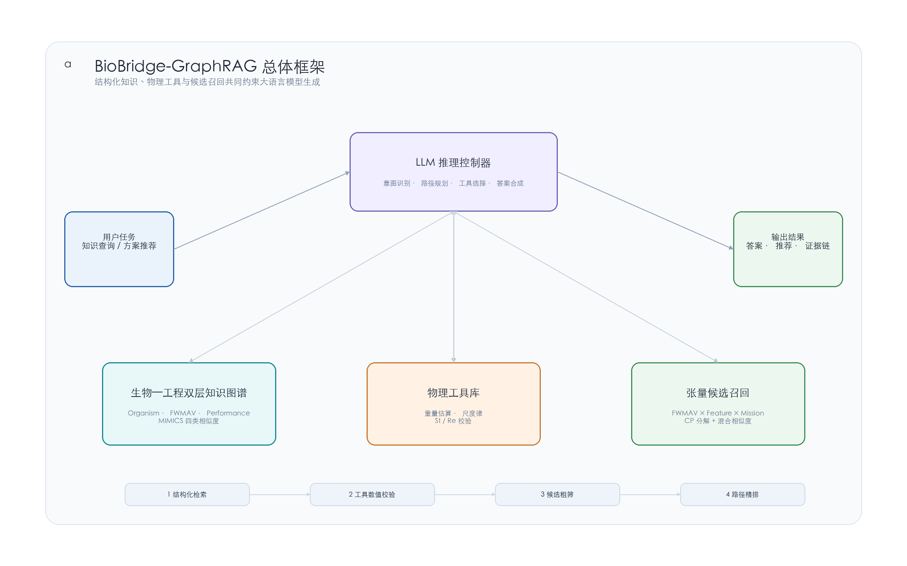
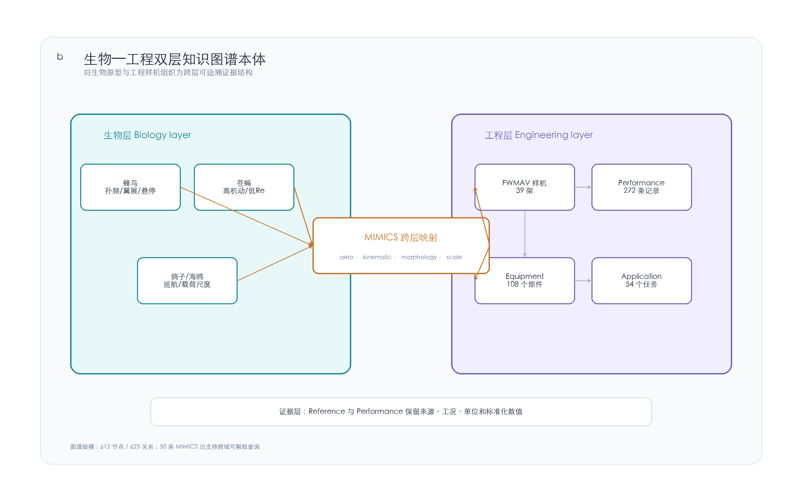
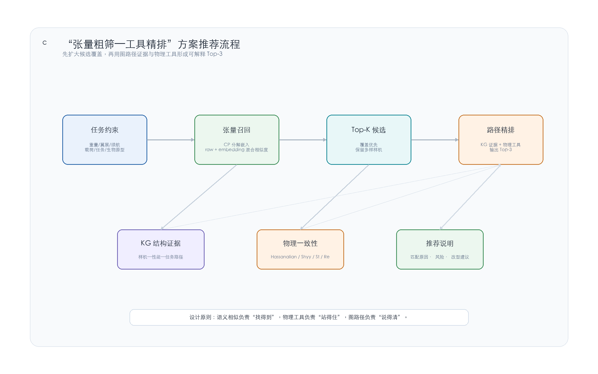
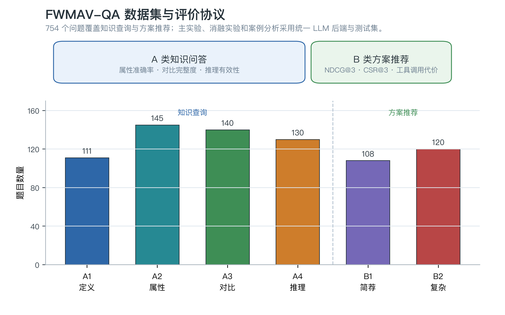
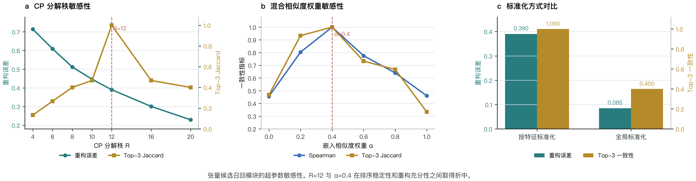

# 图谱增强的扑翼飞行器设计问答方法

**英文题名**：A Graph-Augmented Method for Design Question Answering of Flapping-Wing Aircraft

## 摘要

针对仿生扑翼飞行器概念设计阶段知识来源分散、样机经验难以复用、任务约束与参考方案之间缺少可解释映射等问题，提出一种图谱增强的设计问答方法 BioBridge-GraphRAG。该方法以生物原型与工程样机双层知识图谱为结构化记忆，以大语言模型为推理控制器，将图谱路径检索、物理工具调用和候选方案召回统一组织为可追溯推理链。首先，构建包含 Organism、FlappingWingVehicle、Performance、Equipment、Application 等节点类型的领域知识图谱，并以气动、运动学、形态和尺度 4 类 MIMICS 关系刻画生物原型与工程样机之间的跨域仿生映射；其次，将重量估算、尺度律预测、Strouhal 数校验和 Reynolds 数校验封装为可调用工具，使自然语言问答能够受到物理量纲与一阶可行性约束；进一步，构建飞行器—特征—任务三阶张量，通过 CP 分解与混合相似度实现候选样机粗筛，并在候选集合上执行图路径精排。基于自建 FWMAV-QA 数据集设计知识查询、方案推荐、消融实验和案例分析协议。所提方法为仿生扑翼飞行器概念设计中的知识问答、方案检索和可解释推荐提供了一种可复现技术框架。

**关键词**：知识图谱；大语言模型；扑翼飞行器；图检索增强生成；张量分解；概念设计

**中图分类号**：V279；TP391　　**文献标识码**：A

## Abstract

A graph-augmented design question answering method, named BioBridge-GraphRAG, is proposed for the conceptual design of bio-inspired flapping-wing aircraft. The method addresses three common difficulties in early-stage design: scattered domain knowledge, weak reuse of historical prototype experience, and limited explainability between mission constraints and recommended reference vehicles. BioBridge-GraphRAG uses a bilayer knowledge graph of biological prototypes and engineering vehicles as structured memory, and employs a large language model as the reasoning controller. Graph-path retrieval, physics-tool invocation, and candidate recall are integrated into a traceable reasoning chain. A domain knowledge graph is first constructed with node types such as Organism, FlappingWingVehicle, Performance, Equipment, and Application. Four MIMICS relations, namely aerodynamic, kinematic, morphological, and scale similarities, are used to represent cross-domain bio-inspired mappings. Weight estimation, scaling-law prediction, Strouhal-number checking, and Reynolds-number checking are then encapsulated as callable tools, enabling natural-language answers to be constrained by dimensional consistency and first-order physical feasibility. Furthermore, a vehicle-feature-mission tensor is built and decomposed by CP factorization for coarse candidate recall, followed by graph-path reranking on the candidate set. Experiments are designed on the self-built FWMAV-QA benchmark, covering knowledge queries, design recommendation, ablation studies, and case analysis. The proposed method provides a reproducible framework for explainable knowledge question answering and design recommendation in flapping-wing aircraft conceptual design.

**Key words**: knowledge graph; large language model; flapping-wing aircraft; graph retrieval-augmented generation; tensor decomposition; conceptual design

## 引言

仿生扑翼飞行器通过模拟鸟类、昆虫和蝙蝠等飞行生物的扑翼运动获取升力与推力，兼具尺度小、低速机动能力强、环境适应性好等特点，在复杂环境侦察、生态监测、狭小空间巡检和人机协同等场景中具有应用潜力[1-4]。与固定翼、旋翼飞行器相比，扑翼飞行器在非定常气动、柔性结构、驱动传动和控制耦合方面更为复杂，其概念设计通常需要综合生物原型、历史样机、任务载荷、续航需求、尺度律和低 Reynolds 数气动特性等多类知识。现有方案构思往往依赖“文献检索—经验比对—参数估算—样机验证”的人工迭代流程，存在知识分散、证据追溯困难、跨样机经验复用不足等问题。

知识图谱能够以实体、关系和属性的形式组织多源异构知识，并为检索、推理和解释提供结构化基础。近年来，知识图谱已被用于飞机电源系统故障诊断、航空电子装备智能诊断以及高速飞行器多学科知识分析等航空航天场景[5-7]，也在工程设计知识复用、生物启发设计和复杂产品决策支持中表现出较强的可解释性[8-11]。然而，仿生扑翼飞行器的知识组织具有明显特殊性：生物层的体重、翼展、扑频、飞行速度和悬停能力等参数通常以区间或经验范围形式出现；工程层的样机、部件、任务场景和实验性能记录具有系统工程属性；二者之间的核心语义不是简单的“包含”或“引用”，而是“某一工程样机在何种维度上借鉴了某一生物原型”。若仅采用单层产品知识库，难以表达和查询这种跨域仿生映射。

大语言模型具备较强的自然语言理解和生成能力，为设计知识问答带来新的交互方式。检索增强生成（Retrieval-Augmented Generation, RAG）通过外部知识检索缓解模型幻觉[12]，图检索增强生成（Graph Retrieval-Augmented Generation, GraphRAG）进一步利用知识图谱或图结构索引提供结构化证据[13-16]。已有研究主要面向开放域问答、长文档摘要或通用知识推理，较少处理工程设计中常见的“语义证据、数值公式、任务约束”混合问题。对于扑翼飞行器设计问答，系统不仅要回答“某样机参数是多少”，还要判断“给定载荷和续航目标是否物理可行”，并说明“为什么推荐某一参考样机”。这要求问答系统同时具备结构化证据检索、物理量计算和方案排序能力。

围绕上述需求，本文提出 BioBridge-GraphRAG。该方法以生物—工程双层知识图谱表达仿生映射，以大语言模型规划图谱检索路径和工具调用顺序，以物理工具约束数值判断，以张量分解完成候选样机快速召回。与单纯依赖大语言模型的问答系统相比，所提方法强调知识来源可追溯；与传统知识图谱问答相比，能够处理自然语言任务约束并调用物理公式；与纯向量 RAG 相比，显式保留实体关系、多跳路径和工程解释。

本文主要贡献如下：

（1）构建仿生扑翼飞行器生物—工程双层知识图谱。图谱包含 612 个节点和 625 条关系，通过 4 类 MIMICS 相似关系刻画生物原型与工程样机之间的气动、运动学、形态和尺度映射。

（2）提出尺度律工具增强的图路径推理方法。将重量估算、尺度律预测、Strouhal 数和 Reynolds 数校验封装为可调用工具，使大语言模型在多跳路径推理中能够进行物理一致性检查。

（3）提出面向方案推荐的张量粗筛—路径精排流程。将样机性能、部件配置和任务场景组织为飞行器—特征—任务张量，通过 CP 分解得到候选嵌入，并在候选集合上执行图路径推理和物理校验。

（4）构建 FWMAV-QA 中文测评数据集。数据集覆盖知识定义、属性查询、多实体对比、多跳推理、简单方案推荐和复杂约束推荐 6 类任务，可用于评估扑翼飞行器领域智能问答系统。

## 1 BioBridge-GraphRAG总体框架

BioBridge-GraphRAG 面向两类典型输入：知识查询和方案推荐。知识查询包括概念解释、样机属性查询、跨样机对比和跨域可行性分析；方案推荐则要求系统在给定重量、翼展、续航、载荷、任务类型或生物原型约束时，返回可参考的历史样机及推荐依据。图 1 给出了系统总体框架。

图 1  BioBridge-GraphRAG 总体框架  
Fig. 1  Overall framework of BioBridge-GraphRAG

系统由 3 个核心层次组成。第一层是生物—工程双层知识图谱，保存样机、部件、性能、任务和生物原型等结构化事实；第二层是物理工具库，处理大语言模型不擅长的数值估算和量纲校验；第三层是张量候选召回模块，在方案推荐任务中快速给出 Top-K 候选样机。大语言模型处于控制层，负责识别用户意图、规划图谱关系路径、选择是否调用物理工具，并将图谱证据与工具结果综合成自然语言答案。

设用户查询为 q，知识图谱为 G=(V,E)，工具集合为 T，张量召回器为 R。对于知识查询任务，系统先从 q 中识别实体、属性或关系意图，然后在 G 中检索相关路径，并在涉及物理量判断时调用 T 完成计算。对于方案推荐任务，系统先调用 R 返回候选集合 C_K，再对候选样机执行图谱证据检索和物理可行性校验，最终输出排序后的推荐集合 C_3。该设计将“找到候选”和“解释理由”分离：前者由张量粗筛保证覆盖，后者由图路径推理和物理工具保证可解释性。

## 2 生物—工程双层知识图谱构建

### 2.1 本体设计

仿生扑翼飞行器的知识组织不同于一般飞行器产品知识库，其核心不仅是“样机包含哪些部件”，还包括“样机借鉴了哪种生物以及借鉴维度是什么”。为此，本文将领域知识划分为生物层、工程层和证据层。生物层以 Organism 节点表示飞行生物，包含体重区间、翼展区间、扑频区间、飞行速度、Reynolds 数范围、Strouhal 数范围和悬停能力等属性。工程层以 FlappingWingVehicle 为核心，关联驱动机构、部件、性能记录、任务场景、研制单位和参考文献。证据层通过 Reference 和 Performance 节点保留数据来源和实验条件，避免将不同飞行状态下的性能值混为单一属性。

图 2 展示了双层知识图谱的基本结构。工程样机与生物原型之间通过 MIMICS 关系连接，每条 MIMICS 边包含 4 个相似度分数：气动相似度 s_aero、运动学相似度 s_kin、形态相似度 s_mor 和尺度相似度 s_sca。其中，气动相似度主要考虑 Reynolds 数和 Strouhal 数所在区间，运动学相似度考虑扑频与扑动方式，形态相似度考虑翼形、展弦比和是否具备悬停能力，尺度相似度考虑体重和翼展量级。通过这种关系设计，系统可以回答“哪些样机仿生蜂鸟”“某样机主要在何种维度上仿生某生物”“仿鸟类原型的样机中哪些适合户外巡航”等跨层问题。

图 2  生物—工程双层知识图谱本体  
Fig. 2  Bilayer ontology of biological prototypes and engineering vehicles

### 2.2 数据结构与规模

当前图谱包含 8 类节点和 8 类关系。节点方面，生物原型层包含 23 个 Organism 节点，工程样机层包含 39 个 FlappingWingVehicle 节点，此外包含 272 个 Performance 节点、108 个 Equipment 节点、54 个 Application 节点、44 个 DriveMechanism 节点、39 个 Reference 节点和 33 个 Organization 节点。关系方面，除 MIMICS 外，还包括 HAS_PERFORMANCE、EQUIPPED_WITH、SUITABLE_FOR、HAS_DRIVE_MECHANISM、HAS_REFERENCE、DEVELOPED_BY 和 FUNDED_BY 等关系。表 1 给出图谱规模。

表 1  BioBridge 知识图谱规模  
Table 1  Scale of the BioBridge knowledge graph

| 类型 | 数量 | 作用 |
|---|---:|---|
| Organism | 23 | 描述蜂鸟、苍蝇、鸽子、海鸥等生物原型 |
| FlappingWingVehicle | 39 | 描述公开扑翼样机及其标准化参数 |
| Performance | 272 | 描述重量、翼展、扑频、续航、速度等性能记录 |
| Equipment | 108 | 描述动力、传动、感知、控制、载荷等组件 |
| Application | 54 | 描述侦察、巡航、监测、研究验证等任务场景 |
| DriveMechanism | 44 | 描述四杆机构、压电驱动、电机驱动等传动方式 |
| Reference | 39 | 保存文献来源和资料出处 |
| Organization | 33 | 保存样机研制单位 |
| 关系总数 | 625 | 覆盖 MIMICS、HAS_PERFORMANCE 等 8 类关系 |

为保证数值计算可靠，图谱中的关键物理属性均保留标准化字段。例如，重量统一为 `weight_g_std`，续航统一为 `endurance_s_std`，最大速度统一为 `speed_max_m_s_std`，扑频统一为 `frequency_hz_min_std`。对于文献中以区间形式出现的值，图谱同时保留原始字符串和用于计算的标准化数值。Performance 节点记录 metric、value、unit 和 condition 字段，以区分悬停续航、巡航续航、混合飞行续航、最大速度等不同实验条件。该处理方式采用“实体—属性—来源”的分层建模思路，并进一步面向扑翼飞行器补充生物原型和跨域仿生相似关系。

### 2.3 MIMICS 相似度计算

对于工程样机的单值属性 x 和生物原型的区间属性 [l,u]，若 x∈[l,u]，该维度相似度取 1；若 x 位于区间外，则按对数量级距离衰减：

s(x,[l,u]) = exp{-|ln[x/clip(x,l,u)]|}。　　　　　　　　　　　　　　　　　　　（1）

其中 clip(x,l,u) 表示将 x 截断到区间 [l,u] 后的最近边界值。对于单值与单值比较，采用

s(x,y) = exp{-|ln(x/y)|}。　　　　　　　　　　　　　　　　　　　　　　　　　　（2）

式（1）和式（2）在对数尺度上计算相对差异，适合处理从亚克级微型飞行器到千克级大型扑翼机的跨尺度样机。最终每条 MIMICS 边保存 4 类相似度，并以最大分数对应的维度作为主导仿生类型。该设计使图谱既能支持定性查询，也能支持按相似度阈值筛选路径。

## 3 工具增强的图路径推理

### 3.1 问题形式化

给定自然语言问题 q，系统需要输出答案 a 和证据链 p。对于单跳属性查询，证据链通常是实体—属性或实体—关系路径；对于多跳推理和方案推荐，证据链可能包含多个图谱路径和多个工具计算结果。本文将推理过程表示为

a = M(q, P_G, P_T)，　　　　　　　　　　　　　　　　　　　　　　　　　　　　　（3）

其中 M 为大语言模型，P_G 为从知识图谱检索到的路径集合，P_T 为物理工具返回的结构化结果。与仅将检索文本拼接进提示词的 RAG 不同，BioBridge-GraphRAG 要求模型在生成答案前显式完成两个动作：沿图谱关系寻找证据，必要时调用工具验证物理量。

### 3.2 物理工具库

仿生扑翼飞行器概念设计中常见的数值判断包括重量估算、尺度律预测、Strouhal 数合理性判断和 Reynolds 数区间判断。这些判断分别与微型飞行器重量估算、鸟类扑频尺度律、低速飞行尺度分析以及振荡翼推进效率等基础研究相关[2,17-20]。本文将这些计算封装为 4 个工具，如表 2 所示。工具输入和输出均为结构化 JSON，便于大语言模型在推理链中读取具体数值并引用到最终答案。

表 2  物理工具库及其功能  
Table 2  Physical tools used in graph-path reasoning

| 工具 | 输入 | 输出 | 用途 |
|---|---|---|---|
| hassanalian_weight | 续航时间、载荷、航电重量、电池能量密度 | 估计起飞重量、子系统重量、电池分数、可行性 | 根据任务约束估算总体重量 |
| shyy_scaling_law | 起飞重量 | 翼展、翼面积、翼载荷、扑频、最小功率速度 | 判断样机尺度是否合理 |
| strouhal_check | 扑频、扑幅或翼展、飞行速度 | Strouhal 数、是否处于 0.2-0.4 区间 | 判断非定常推进效率 |
| reynolds_check | 翼弦、飞行速度、温度或高度 | Reynolds 数、低 Re 区间判断 | 判断气动机理和建模适用性 |

工具库的作用不是替代高保真气动仿真，而是在概念设计阶段提供快速、透明、可解释的一阶物理筛查。例如，对于“参考蜂鸟设计 50 g 载荷、30 min 续航扑翼机是否可行”的问题，系统需要先查询蜂鸟体重和翼展范围，再通过重量估算判断任务所需起飞重量，最后将二者尺度进行比较。如果仅由大语言模型直接生成答案，模型可能给出“可参考蜂鸟扑动方式”的模糊建议；引入工具后，答案必须受到数值结果约束。

### 3.3 路径推理流程

BioBridge-GraphRAG 的路径推理流程包括 5 个步骤：

（1）意图识别与实体锚定。判断问题属于定义、属性、对比、推理或推荐任务，并识别样机、生物原型、任务约束等实体。

（2）关系路径规划。根据当前实体及问题意图选择候选关系，如 MIMICS、HAS_PERFORMANCE、SUITABLE_FOR 或 DEVELOPED_BY。

（3）图谱证据检索。沿候选关系查询实体属性、邻接节点和性能记录，形成结构化观察结果。

（4）工具触发与计算。当问题涉及载荷、续航、扑频、速度或翼展等可计算约束时，调用相应物理工具。

（5）答案合成与证据引用。综合图谱路径和工具结果，生成包含结论、依据和限制条件的答案。

这一流程与 ReAct 范式一致：大语言模型先决定下一步动作，再接收图谱或工具返回的观察结果，随后继续推理或给出最终答案[21]。区别在于，本文的动作空间被限制在领域图谱检索和物理工具调用之内，从而提高推理过程的可控性和可解释性。

## 4 基于张量分解的方案候选检索

### 4.1 张量构建

对于方案推荐任务，如果直接对图谱中所有样机逐一进行多跳推理和工具校验，系统开销会随样机数量增长。考虑到概念设计阶段首先需要获得覆盖充分的候选集合，本文引入张量粗筛模块。根据当前图谱结构，构建三阶张量

X∈R^(N_v×N_f×N_m)，　　　　　　　　　　　　　　　　　　　　　　　　　　　（4）

其中 N_v 为样机数量，N_f 为特征维度数量，N_m 为任务类别数量。特征维度由 Performance 指标和 Equipment 类别计数组成，包括重量、翼展、扑频、速度、续航、是否悬停、展弦比估计以及关键组件类别等；任务维度由 Application 节点聚合为 research、task、maneuver、performance 和 other 等类别。对每个样机，仅在其适用任务类别下激活对应特征。

为避免翼展、重量等大方差特征支配分解结果，本文采用按特征维度独立的 z-score 标准化。对于第 f 个特征，有

x̂_ifm = (x_ifm-μ_f)/(σ_f+ε)，　　　　　　　　　　　　　　　　　　　　　　　　（5）

其中 μ_f 和 σ_f 分别为该特征在全部样机和任务维度上的均值与标准差，ε 为防止除零的小常数。

### 4.2 CP 分解与混合相似度

对标准化张量执行 CANDECOMP/PARAFAC（CP）分解[22]。张量分解已被广泛用于多关系数据表示和知识图谱补全[23]，适合在样机、特征和任务三类对象之间挖掘潜在关联：

X≈Σ_(r=1)^R λ_r u_r∘v_r∘w_r，　　　　　　　　　　　　　　　　　　　　　　（6）

其中 u_r、v_r 和 w_r 分别表示样机、特征和任务 3 个模态上的潜在因子，R 为分解秩，∘ 表示外积。样机嵌入由 U=[u_1,...,u_R] 给出。对于用户输入的任务约束，系统先将其转换为查询特征向量，再分别计算原始特征空间相似度和 CP 嵌入空间相似度，得到混合得分

S(i,q)=(1-α)cos(x_i,x_q)+αcos(u_i,u_q)，　　　　　　　　　　　　　　　　　　（7）

其中 α 为嵌入相似度权重。原始特征空间保留物理量级匹配，CP 嵌入空间引入潜在语义关联。该混合策略可以缓解小样本张量分解中纯嵌入空间不稳定的问题。

### 4.3 粗筛—精排推荐流程

图 3 给出了方案推荐流程。系统首先根据任务约束调用张量召回模块返回 Top-K 候选；随后对候选样机逐一查询其性能、任务和仿生映射证据，并调用物理工具进行可行性校验；最后输出 Top-3 推荐、排序依据和风险提示。

图 3  张量粗筛—工具精排方案推荐流程  
Fig. 3  Tensor-recall and tool-reranking workflow for design recommendation

该流程的工程含义在于分工明确：张量分解负责从历史样机中快速扩大候选覆盖，图路径推理负责解释候选与任务之间的关系，物理工具负责判断候选是否满足载荷、续航和尺度律约束。相比纯向量检索，该流程显式保留样机—任务—性能路径；相比直接枚举所有样机进行工具校验，该流程将计算集中在 Top-K 候选上，具有更好的扩展性。

## 5 数据集与实验设计

### 5.1 FWMAV-QA数据集

为评估扑翼飞行器领域问答与方案推荐能力，本文构建 FWMAV-QA 数据集。数据集共 754 题，其中 200 题为人工标注，554 题为基于图谱模板生成并经校验的数据。题型分为 A 类知识查询和 B 类方案推荐两大类，具体如表 3 和图 4 所示。每道 A 类题包含问题、参考答案、金实体、期望跳数和可选工具调用要求；每道 B 类题包含任务约束、金推荐样机和推荐理由。该设计使数据集既能评估事实查询，也能评估方案推荐中的实体召回、约束满足和推荐解释质量。

图 4  FWMAV-QA 数据集与评价协议  
Fig. 4  FWMAV-QA benchmark and evaluation protocol

表 3  FWMAV-QA 数据集题型分布  
Table 3  Category distribution of the FWMAV-QA benchmark

| 类别 | 任务 | 数量 | 主要评估能力 |
|---|---|---:|---|
| A1 | 单跳定义 | 111 | 概念解释和公式理解 |
| A2 | 单跳属性 | 145 | 样机或生物属性查询 |
| A3 | 多实体对比 | 140 | 多实体、多维度信息聚合 |
| A4 | 多跳推理 | 130 | 生物—工程跨域推理与物理判断 |
| B1 | 简单方案推荐 | 108 | 单约束或少量约束下的样机推荐 |
| B2 | 复杂方案推荐 | 120 | 多约束、含生物原型的方案推荐 |

### 5.2 对比方法与评价指标

实验拟比较 5 类系统，如表 4 所示。为避免 A1 定义类问题对通用大语言模型过于友好，主实验以 A2、A3、A4 为主要知识问答评测对象；B1、B2 用于方案推荐评测。所有系统使用相同大语言模型后端、相同测试题集和相同最大输出长度，以保证可比性。

表 4  对比系统设置  
Table 4  Baseline systems and model variants

| 系统 | 主要机制 | 作用 |
|---|---|---|
| Pure LLM | 仅使用大语言模型直接回答 | 检验无外部知识条件下的基线能力 |
| VectorRAG | 将图谱展平为文本块后向量检索 | 检验传统语义检索增强效果 |
| KG-RAG | 实体抽取后检索 1-2 跳图谱子图 | 检验静态图谱证据注入效果 |
| ToG | 大语言模型在知识图谱上逐步探索关系 | 检验无物理工具的图路径推理能力 |
| BioBridge-GraphRAG | 双层图谱、物理工具、张量召回和 ReAct 推理 | 检验完整方法效果 |

A 类知识问答采用 3 类指标：A2 属性准确率、A3 对比完整度和 A4 推理有效性。属性准确率关注答案中实体—属性—数值三元组是否与参考答案一致；对比完整度关注对比实体、维度和数值是否覆盖；推理有效性关注核心结论是否正确以及证据实体是否充分。B 类方案推荐采用 NDCG@3 和约束满足率（Constraint Satisfaction Rate, CSR）评价。NDCG@3 衡量推荐列表与金推荐列表的排序一致性；CSR 衡量推荐样机是否满足任务中可形式化表达的硬约束。系统效率以平均时延、平均工具调用次数和平均推理轮数衡量。

### 5.3 主实验与消融实验填报表

完整实验完成后，应将主实验结果填入表 5 和表 6。表中数值建议保留 3 位小数，并在正文中围绕“整体效果”“A4 多跳推理”“推荐约束满足”“效率代价”4 个角度分析。为避免预实验结果与最终主实验混用，本文不将未完整覆盖全部系统和全部题型的中间结果作为性能结论。

表 5  A 类知识问答主实验结果  
Table 5  Main results on knowledge-query tasks

| 系统 | A2 属性准确率 ↑ | A3 对比完整度 ↑ | A4 推理有效性 ↑ | 平均时延/s ↓ |
|---|---:|---:|---:|---:|
| Pure LLM | 待填 | 待填 | 待填 | 待填 |
| VectorRAG | 待填 | 待填 | 待填 | 待填 |
| KG-RAG | 待填 | 待填 | 待填 | 待填 |
| ToG | 待填 | 待填 | 待填 | 待填 |
| BioBridge-GraphRAG | 待填 | 待填 | 待填 | 待填 |

表 6  B 类方案推荐主实验结果  
Table 6  Main results on design-recommendation tasks

| 系统 | NDCG@3 ↑ | CSR@3 ↑ | 平均工具调用次数 ↓ | 平均时延/s ↓ |
|---|---:|---:|---:|---:|
| Pure LLM | 待填 | 待填 | 待填 | 待填 |
| VectorRAG | 待填 | 待填 | 待填 | 待填 |
| KG-RAG | 待填 | 待填 | 待填 | 待填 |
| ToG | 待填 | 待填 | 待填 | 待填 |
| BioBridge-GraphRAG | 待填 | 待填 | 待填 | 待填 |

除主实验外，还应进行消融实验以验证各模块贡献。本文设置 w/o 双层本体、w/o 物理工具、w/o 张量粗筛和 w/o 路径推理 4 个变体。若去除路径推理后 A4 指标显著下降，说明多跳路径规划是系统核心；若去除物理工具后 B 类 CSR 下降，说明物理校验对方案推荐必要；若去除张量粗筛后时延或工具调用次数上升，说明粗筛模块对扩展性有贡献；若去除双层本体后跨域题表现下降或检索轮数增加，说明 MIMICS 关系有助于生物—工程证据组织。

表 7  消融实验结果  
Table 7  Ablation results

| 变体 | A4 推理有效性 ↑ | NDCG@3 ↑ | CSR@3 ↑ | 平均时延/s ↓ | 主要观察 |
|---|---:|---:|---:|---:|---|
| Full | 待填 | 待填 | 待填 | 待填 | 待填 |
| w/o 双层本体 | 待填 | 待填 | 待填 | 待填 | 待填 |
| w/o 物理工具 | 待填 | 待填 | 待填 | 待填 | 待填 |
| w/o 张量粗筛 | 待填 | 待填 | 待填 | 待填 | 待填 |
| w/o 路径推理 | 待填 | 待填 | 待填 | 待填 | 待填 |

### 5.4 张量召回敏感性分析

张量召回模块涉及分解秩 R、混合相似度权重 α 和标准化方式 3 个关键设置。图 5 给出敏感性实验结果。随着 R 从 4 增至 20，重构误差单调下降，但候选排序稳定性并不随 R 单调提升。当 R=12 时，Top-3 Jaccard 达到 1.000，说明该设置在重构充分性与排序稳定性之间取得较好折中。固定 R=12 后，α=0.4 时 Spearman 相关系数和 Top-3 Jaccard 均达到最高；α=0 表示仅使用原始特征，难以捕捉潜在任务关联；α=1 表示仅使用 CP 嵌入，在小样本条件下排序稳定性下降。标准化方式对比显示，虽然全局标准化可获得更低重构误差，但按特征标准化的 Top-3 一致性更高，更符合方案召回中“候选稳定性优先”的需求。

图 5  张量召回模块超参数敏感性  
Fig. 5  Hyperparameter sensitivity of the tensor-recall module

### 5.5 案例分析设置

为增强工程可读性，正式实验结果填入后可保留 2-3 个案例。案例不宜写成运行日志，而应围绕设计结论展开。建议案例包括：（1）Strouhal 数校验：给定 DelFly Nimble 的扑频、翼展和飞行速度，系统计算 Strouhal 数并判断是否处于高效推进区间；（2）跨域可行性分析：给定“蜂鸟原型、30 min 续航、50 g 载荷”的任务，系统先查询蜂鸟参数，再调用重量估算和尺度律工具，最后给出是否可行及替代生物原型建议；（3）户外巡航推荐：给定重量、续航和任务场景约束，系统先用张量召回候选，再用图谱证据和物理工具重排，输出 Top-3 样机及推荐理由。若选择悬停昆虫型样机作为案例，可结合 21 g 级仿昆虫飞行器和 KUBeetle-S 等公开样机讨论驱动、电源和控制配置差异[24-25]。

## 6 讨论

BioBridge-GraphRAG 的核心价值不在于让大语言模型替代设计师，而在于将分散的领域知识、历史样机经验和概念设计中的一阶物理判断组织成可追溯的交互式推理过程。对于仿生扑翼飞行器这类跨学科设计对象，单一技术路线往往难以同时满足自然语言交互、图谱证据追溯、数值物理校验和方案推荐效率要求。本文方法通过双层知识图谱、物理工具和张量召回的组合，在系统层面形成互补。

双层知识图谱提供领域语义骨架。MIMICS 关系使“仿生”不再只是样机描述中的字符串，而成为可查询、可排序、可解释的跨层边。物理工具提供概念设计阶段的数值约束。由于工具输出结构化结果，模型在最终回答中可以引用具体数值和判断依据，从而降低纯语言生成的随意性。张量粗筛提供候选生成能力。它不要求在召回阶段就给出最终推荐，而是以覆盖为优先，将可解释排序留给后续图路径推理和物理校验。

本文方法仍存在局限。首先，当前图谱规模受公开样机资料限制，样机数量仍较小，张量分解的潜在因子稳定性有待随数据规模扩大进一步验证。其次，重量估算和尺度律工具适合概念设计阶段的一阶判断，不能替代高保真 CFD、结构动力学仿真和样机试验。再次，方案推荐的金标准具有一定主观性，需要多名领域专家参与标注，以减少单一标注者偏差。最后，现阶段推理流程以贪心式多轮 ReAct 为主，未来可引入束搜索或不确定性估计，以提升复杂多路径问题的覆盖能力。

## 7 结论

针对仿生扑翼飞行器概念设计阶段知识分散、经验难复用和任务驱动推荐缺乏可解释方法的问题，提出了图谱增强的扑翼飞行器设计问答方法 BioBridge-GraphRAG。该方法构建生物原型层与工程样机层相结合的双层知识图谱，利用 4 类 MIMICS 关系表达跨域仿生映射；将重量估算、尺度律预测、Strouhal 数和 Reynolds 数校验封装为可调用物理工具，使大语言模型在图路径推理中具备数值校验能力；并通过飞行器—特征—任务张量分解实现候选样机粗筛，形成“粗筛—精排”的设计推荐流程。

本文还构建了 FWMAV-QA 中文测评数据集，为扑翼飞行器领域知识问答和方案推荐系统提供了可复现实验基础。后续工作将从 3 个方面展开：扩展样机和生物原型数据规模，提升张量召回稳定性；引入多专家推荐标注，完善方案推荐评价体系；将图路径推理从单路径 ReAct 扩展为多候选束搜索，以增强复杂任务下的证据覆盖和鲁棒性。

## 参考文献

[1] SHYY W, AONO H, CHIMAKURTHI S K, et al. An introduction to flapping wing aerodynamics[M]. Cambridge: Cambridge University Press, 2013.

[2] HASSANALIAN M, ABDELKEFI A. Methodologies for weight estimation of fixed and flapping wing micro air vehicles[J]. Meccanica, 2017, 52(9): 2047-2068.

[3] KEENNON M, KLINGEBIEL K, WON H, et al. Development of the Nano Hummingbird: a tailless flapping wing micro air vehicle[C]//50th AIAA Aerospace Sciences Meeting. Reston: AIAA, 2012.

[4] KARÁSEK M, MUIJRES F T, DE WAGTER C, et al. A tailless aerial robotic flapper reveals that flies use torque coupling in rapid banked turns[J]. Science, 2018, 361(6407): 1089-1094.

[5] 聂同攀, 曾继炎, 程玉杰, 等. 面向飞机电源系统故障诊断的知识图谱构建技术及应用[J]. 航空学报, 2022, 43(8): 625499.

[6] 程玉杰, 胡峥, 高永梅, 等. 知识图谱与大模型融合驱动的航空电子装备故障诊断[J/OL]. 航空学报, doi: 10.7527/S1000-6893.2026.33284.

[7] 安凯, 黄伟, 王振国, 等. AI驱动高速飞行器多学科发展知识图谱分析[J]. 航空学报, 2024(S1): 730566.

[8] SARICA S, SONG B, LOW M Y H, et al. Engineering knowledge graph for keyword discovery in patent search[J]. Advanced Engineering Informatics, 2020, 44: 101105.

[9] JIA Y, LIU J, WANG G, et al. An approach to capturing and reusing tacit design knowledge using relational learning for knowledge graphs[J]. Advanced Engineering Informatics, 2022, 51: 101505.

[10] CHEN Y, YU S, CHILTON L B, et al. A knowledge graph-based bio-inspired design approach for knowledge retrieval and reasoning[J]. Journal of Engineering Design, 2025, 36(7-9): 1321-1351.

[11] HUANG C, ZHANG Y, YU S, et al. A case-based knowledge graph with reinforcement learning for the intelligent design approach of complex product[J]. Journal of Engineering Design, 2025, 36(7-9): 1451-1478.

[12] LEWIS P, PEREZ E, PIKTUS A, et al. Retrieval-augmented generation for knowledge-intensive NLP tasks[C]//Advances in Neural Information Processing Systems. 2020: 9459-9474.

[13] EDGE D, TRINH H, CHENG N, et al. From local to global: a graph RAG approach to query-focused summarization[EB/OL]. arXiv:2404.16130, 2024.

[14] SUN J, XU C, TANG L, et al. Think-on-Graph: deep and responsible reasoning of large language model on knowledge graph[C]//International Conference on Learning Representations. 2024.

[15] PAN S, LUO L, WANG Y, et al. Unifying large language models and knowledge graphs: a roadmap[J]. IEEE Transactions on Knowledge and Data Engineering, 2024, 36(7): 3580-3599.

[16] LI X, ZHAO R, CHENG Y, et al. A survey of graph retrieval-augmented generation for customized large language models[EB/OL]. arXiv:2501.13958, 2025.

[17] PENNYCUICK C J. Wingbeat frequency of birds in steady cruising flight: new data and improved predictions[J]. Journal of Experimental Biology, 1996, 199(7): 1613-1618.

[18] GREENEWALT C H. The flight of birds[J]. Transactions of the American Philosophical Society, 1975, 65(4): 1-67.

[19] TENNEKES H. The simple science of flight: from insects to jumbo jets[M]. Cambridge, MA: MIT Press, 2009.

[20] TRIANTAFYLLOU G S, TRIANTAFYLLOU M S, GROSENBAUGH M A. Optimal thrust development in oscillating foils with application to fish propulsion[J]. Journal of Fluids and Structures, 1993, 7(2): 205-224.

[21] YAO S, ZHAO J, YU D, et al. ReAct: synergizing reasoning and acting in language models[C]//International Conference on Learning Representations. 2023.

[22] KOLDA T G, BADER B W. Tensor decompositions and applications[J]. SIAM Review, 2009, 51(3): 455-500.

[23] BALAŽEVIĆ I, ALLEN C, HOSPODAŘ J. TuckER: tensor factorization for knowledge graph completion[C]//Proceedings of EMNLP-IJCNLP. 2019: 5185-5194.

[24] PHAN H V, KANG T, PARK H C. Design and stable flight of a 21 g insect-like tailless flapping wing micro air vehicle with angular rates feedback control[J]. Bioinspiration & Biomimetics, 2017, 12(3): 036006.

[25] PHAN H V, PARK H C. KUBeetle-S: an insect-like, tailless, hover-capable robot that can fly with a low-voltage power source[J]. International Journal of Micro Air Vehicles, 2019, 11: 1-12.
